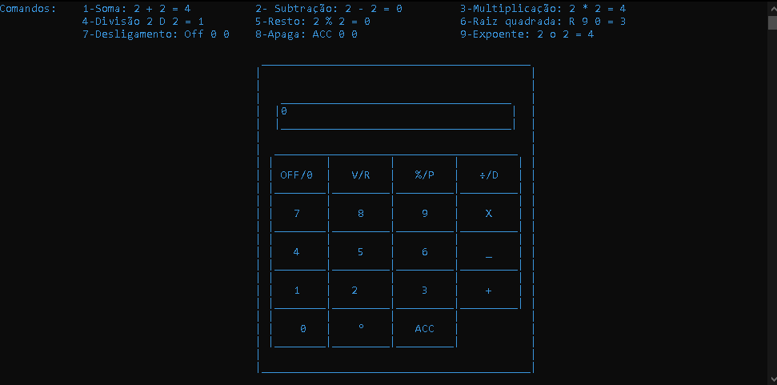

# BATWAVE BETA 0.2V
The "BatWave" project is inspired by the iconic system used by Batman, incorporating a series of advanced and
      interactive features, developed in C#. This all-in-one system is designed to be a powerful tool for both everyday
      use and entertainment, combining security, utility and customization.
      
      °Functionalities
      
      Password and Password Change:
      Implementation of an authentication system that requires a password to access the BatComputer.
      Function to allow secure password change by the authenticated user.
      
      1-Roulette:
      A roulette mini-game where the user can try their luck, using concepts of random generation and game logic.
      
      2-System and User Name Change:
      Functions to customize the system and user name, immediately reflecting these changes in the interface.
      
      3-Real Time Date and Time:
      Continuous display of date and time updated in real time, using threads to maintain accuracy.
      Change of Visual Aspects:
      Ability to change the color of the console, allowing users to customize the interface to their preferences.
      
      4-Calculator:
      A built-in calculator that can perform basic arithmetic operations, integrating a mathematical expression parser.

      
      
      5-Rock, Paper, Scissors Game:
      Implementation of the classic Rock, Paper, Scissors game, with logic to determine the winner between the user and
      the computer.
      
      7-Greeting Recognition:
      Function that recognizes the time of day (morning, afternoon, night) and greets the user accordingly, using the
      current system time.
      
      The project is developed using several advanced programming concepts in C#, including:
      
      -Heritage:
      Using inheritance to create a structure of classes that share common behaviors, as base classes for different
      types
      of games and tools.
      
      -Recursion:
      Implementation of recursive algorithms for functions that require repetitive calculations, such as when solving
      complex mathematical problems.
      
      -Exception Handling:
      Use of try-catch blocks to manage errors and ensure that the system functions robustly and securely, especially in
      critical operations such as authentication and data manipulation.
      
      -Classes and Objects:
      Creation of several classes to represent the system's functionalities, such as User, SystemSettings, and Game,
      promoting an organized and modular structure.
      
      12-Data storage:
      Implementation of methods to store and retrieve configuration data and user preferences, using text files and
      databases.
